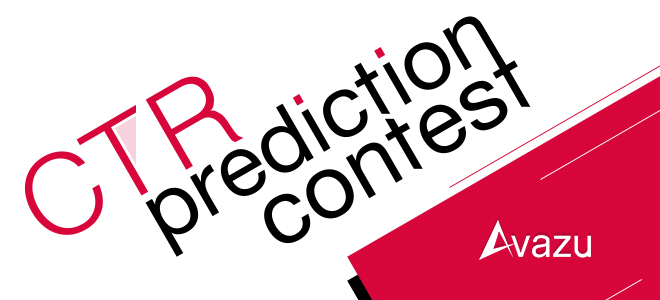

# Click-Through-Rate-Prediction

In online advertising, click-through rate (CTR) is a very important metric for evaluating ad performance. As a result, click prediction systems are essential and widely used for sponsored search and real-time bidding.

# Methods
This study consists of 8 processes. The details are described follows;

1. **Data acquisition** 
The collection of data in this study is retrieved from kaggle following this link: "https://www.kaggle.com/c/avazu-ctr-prediction/data" including 10 days of click-through data, ordered chronologically. Non-clicks and clicks are subsampled according to different strategies.

2. **Import Data with Chunking** 
This data has an enormous size which cannot import all data directly. However, we can use the chunking method to iteration import each chunk od data. 

3. **Exploratory Data Analysis** 
The exploratory data analysis or “EDA” is a critical first step in analyzing the data from an experiment. Here are the main reasons we use EDA:
    - detection of mistakes
    - checking of assumptions
    - preliminary selection of appropriate models
    - determining relationships among the explanatory variables, and
    - assessing the direction and rough size of relationships between explanatory and outcome variables.

4. **Data preparation and preprocessing.** 
    **4.1 Feature Selection**  
We all may have faced this problem of identifying the related features from a set of data and removing the irrelevant or less important features with do not contribute much to our target variable in order to achieve better accuracy for our model.
Feature Selection is one of the core concepts in machine learning which hugely impacts the performance of your model. The data features that you use to train your machine learning models have a huge influence on the performance you can achieve.
Irrelevant or partially relevant features can negatively impact model performance. 
    **4.2 Encoding Categorical Features** 
One hot encoding is a process by which categorical variables are converted into a form that could be provided to ML algorithms to do a better job in prediction. 
    **4.3 Handling Imbalanced Data** 
Imbalanced classes are a common problem in machine learning classification where there is a disproportionate ratio of observations in each class. Class imbalance can be found in many different areas, including medical diagnosis, spam filtering, and fraud detection. In this study, due to we have a vast dataset; thus, we will perform the undersampling technique for the majority class(Non-Click,0).

5. **Transform Feature**  
After we get the list of selected feature, we have to eliminate feature value which is not in the list. We will use this step to trandform feature before we encode feature and split data to train and test.

6. **Split data** 
For developing sentiment classifier, we will split data into two sets, which are training set (training data and validation data) and testing set with stratifying class. The new model is developed on the training set and test it on the holdout set.

7. **Developing model and Fine-tuning hyperparameter** 
In this study, we will develop a model from Extra Trees Classifier which is bagging of ensemble method, Light GBM which is boosting of ensemble method, and Logistic Regression. The model hyperparameters are tuned by using grid-search based on accuracy to get the best parameter.
 

8. **Evaluation** 
After the model is built, we will evaluates it with testing set by using <u>Average Precision</u>  and other metrics such as AUC, Recall, and F1 to estimate the performance. The model with the highest performance is chosen.

 
